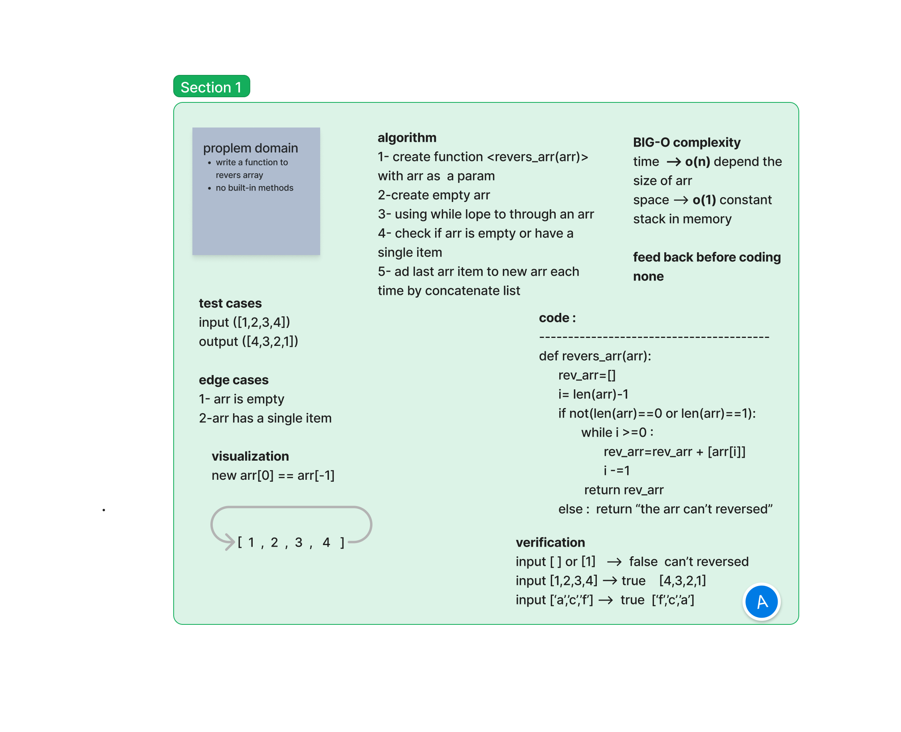

# revers array
write a function to revers an array

## Whiteboard Process

## Approach & Efficiency
using for lop torevers array

or we can use built-in method `arr.revers()`

the function used to revers an arr hat has more than one item inside it

## Solution
 to check solution see [solution](./revers_arr.py)

