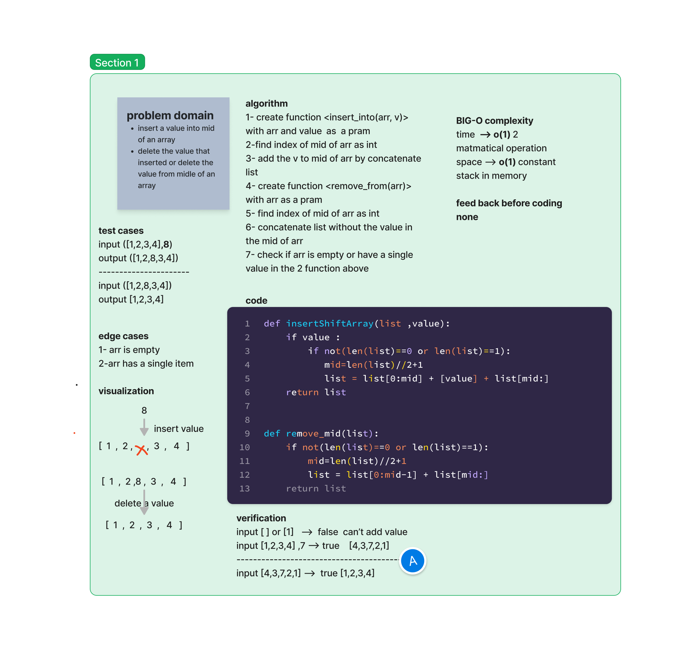

# array insert shift 

## Whiteboard Process

## Approach & Efficiency
using index and + operator 

first function acsept 2 parms  arr and value  and added the value to the mid of arr
second function acsept an arr as an arg  and delete the value from the mid of arr

## Solution
[solution](./array_insert_shift.py)
[test](./test_array_insert_shift.py)